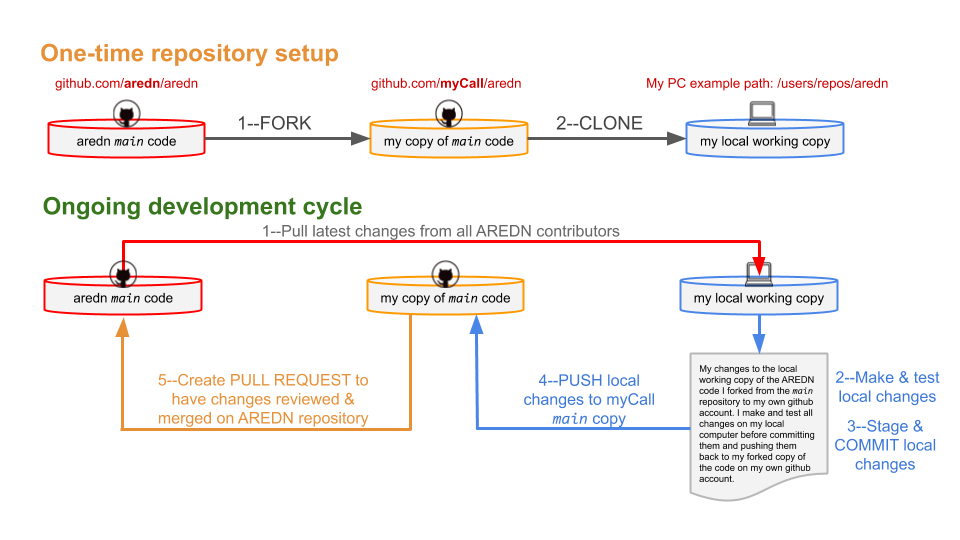

# How to Use GitHub
## Contributing to the AREDN® Project

### Create Your GitHub Account

To contribute to the AREDN® project you first must create your own GitHub account. This is free and easy to do by following these steps:

1. Open your web browser and navigate to the GitHub URL `https://github.com`.
2. Click the `Sign Up` button and enter a username, email, and password. We suggest using your callsign as the username which will be indicated below as "myCall". You can, however, create any username you desire. Substitute your actual GitHub username for "myCall" in the examples below.
3. On the GitHub website, click the `Sign In` button and enter your username or email, followed by your github password.
4. You can enter "aredn" into the search bar to find all repositories related to AREDN®, or if you want to contribute directly to the AREDN® firmware you can type this URL into your web browser: `https://github.com/aredn/aredn`.

### Understanding GitHub Workflow

The process of contributing and tracking changes to AREDN® is circular. Code is maintained in the `aredn/aredn` repository on GitHub. To contribute a potential code update, you must first FORK the `aredn/aredn` repository to your own GitHub account. You then CLONE your copy of the code from your GitHub repository to your own local computer. Make and test any changes you want to contribute using your local computer's copy of the code.

When you are satisfied with your changes, stage and COMMIT them to your local computer's repository, then PUSH those local changes to your copy of the code on your own GitHub account. Finally, create a PULL REQUEST, which tells the AREDN® development team that you would like your changes to be reviewed for inclusion in the `aredn/aredn` repository.

#### One-time Repository Setup:

1. Login to your own GitHub account and navigate in your browser to `https://github.com/aredn/aredn`
2. Click the `Fork` button on the upper right side of the page.  You now have a copy of the AREDN® source code on your own GitHub account.
3. Go to your local computer and copy your fork of the AREDN® source code: `git clone https://github.com/[myCall]/aredn`
4. `cd aredn`  This directory contains your local copy of the AREDN® source code. The following commands will be executed while you are in this directory or its subdirectories.
5. `git remote add aredn https://github.com/aredn/aredn`  

Now your local environment knows about both the `aredn/aredn` code repository and your forked copy on your GitHub account.

#### Ongoing Development Cycle:

1. Update your local environment with the latest code changes from the rest of the community, which will include any changes you had previously submitted.   *Caution:*  never make code changes directly on the `main` branch.  This will result in inconsistencies between the main repository and your repository, requiring a force-remove of any changes you have made.
	1. `git checkout main`
	2. `git pull aredn main`
2. Create a git code branch to fix a bug or implement a new feature:
	1. `git checkout -b my-wiz-bang-feature-name`
3. Make your changes and test them.
4. When ready to submit changes, check to see whether they still work with code others have recently submitted. In GitHub terminology, “pull” down the latest changes and “rebase” or move your code on top of the latest. In this process you might find conflicts with someone else’s code, making further merge edits necessary.
	1. `git stash` to stash the changes still in process.
	2. `git checkout main`
	3. `git pull aredn main`
	4. `git checkout my-wiz-bang-feature-name`
	5. `git rebase main` to move your branch and changes on top of the latest code others have submitted.
	6. `git stash pop` to reapply your stashed changes
	7. Resolve any conflicts that need to be merged if warned in the step above.
	8. Final build and validation that your changes work on top of the latest changes from all of the AREDN® contributors.
5. `Commit` your changes to your local repository, then `Push` the changes to your own GitHub repository.
	1. `git add [any-changed-files]` (stage changes for commit)
	2. `git commit` (Be sure to commit your changes with a meaningful commit message. You can refer to the standards used by OpenWRT <https://openwrt.org/submitting-patches> for creating commit descriptions that are easy for others to understand. The key is a commit description that concisely communicates to others what is in the commit.)
	3. `git push origin my-wiz-bang-feature-name`
6. Create a `Pull Request` (PR) to the `aredn/aredn` repository by browsing to `github.com/[myCall]/aredn`, then select the my-wiz-bang-feature-name branch. Click the `New Pull Request` button to generate your Pull Request. Others can now review your code, test it, and give feedback. If feedback is given and you need to make changes, go back to step 3.
7. Once your changes have been accepted into the `aredn/aredn` repository, delete your branch:
	1. On your local repository: `git branch -D my-wiz-bang-feature-name`
	2. On your forked copy of your GitHub repository: `git push origin --delete my-wiz-bang-feature-name`

You can continue contributing new features by beginning the development cycle again, starting with step 1 on the Ongoing Development Cycle.
